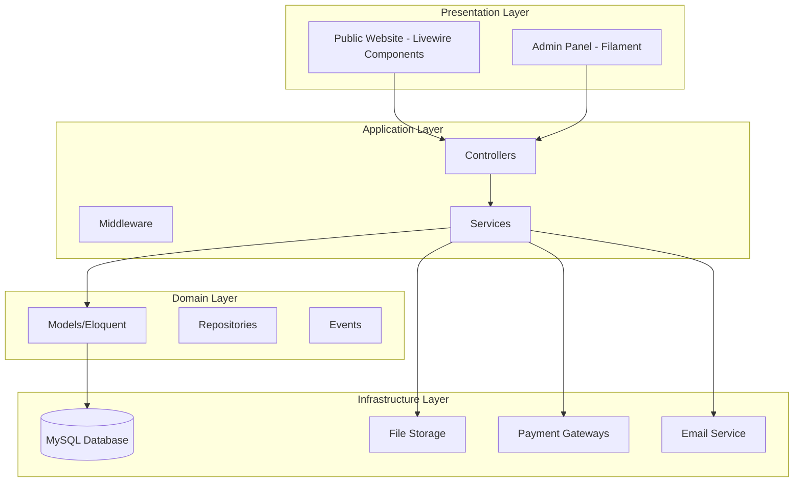
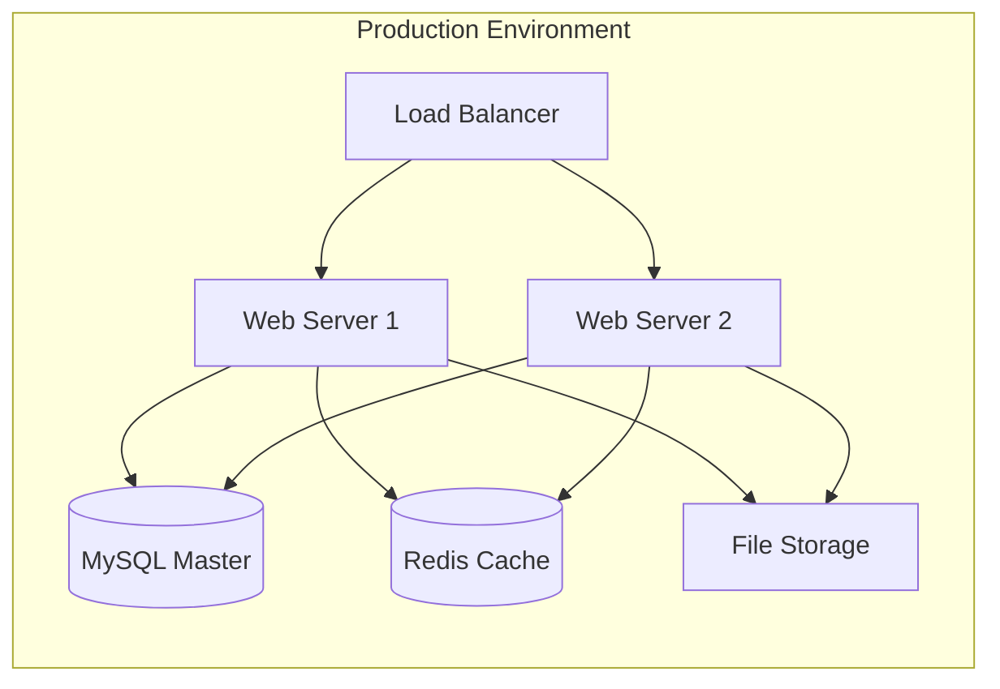
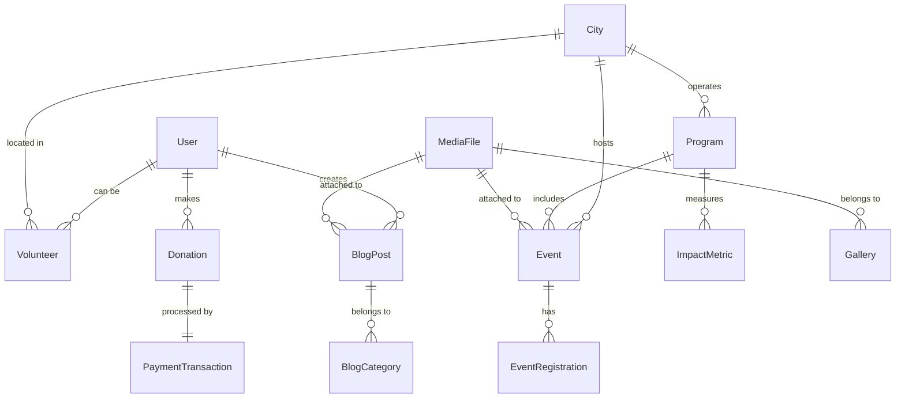

# Design Document: NGO Master Website

## Overview

The Buddhabhoomi Human Service Ashram website will be built as a comprehensive Laravel application using the TALL stack (Tailwind CSS, Alpine.js, Laravel, Livewire) with Filament for admin panel functionality. The system follows a clean MVC architecture with component-based UI design, ensuring scalability, maintainability, and professional presentation suitable for international NGO standards.

The application serves dual purposes: a public-facing website for transparency, donations, and volunteer engagement, and a robust administrative system for content management, volunteer coordination, and impact tracking. The design emphasizes trust-building through professional aesthetics, transparent operations, and secure payment processing.

## Architecture

### System Architecture

The application follows a layered architecture pattern:



### Technology Stack

- **Backend Framework**: Laravel 11 LTS
- **Frontend Framework**: Livewire 3.x with Alpine.js
- **Admin Panel**: Filament 3.x
- **Database**: MySQL 8.0+
- **Styling**: Tailwind CSS 3.x
- **Payment Integration**: eSewa, Khalti APIs
- **File Storage**: Laravel Storage with local/cloud support
- **Email**: Laravel Mail with queue support
- **Caching**: Redis for session and cache management

### Deployment Architecture



## Components and Interfaces

### Public Website Components

#### Homepage Component
- **Hero Section**: Dynamic banner with mission statement and call-to-action
- **Impact Counter**: Real-time statistics display with animated counters
- **Featured Activities**: Carousel of recent activities with images and descriptions
- **Testimonials**: Rotating testimonials from beneficiaries and volunteers
- **Partner Logos**: Grid display of partner organizations and sponsors

#### Navigation Component
- **Multi-language Toggle**: Nepali/English language switcher
- **Responsive Menu**: Mobile-first navigation with hamburger menu
- **Breadcrumb**: Contextual navigation for deep pages
- **Search Functionality**: Site-wide search with filters

#### Content Components
- **Blog Post Card**: Reusable component for blog listings
- **Event Card**: Event display with date, location, and registration
- **Gallery Grid**: Responsive image gallery with lightbox
- **Volunteer Form**: Multi-step registration with validation
- **Donation Form**: Secure payment form with gateway selection

### Admin Panel Components (Filament)

#### Dashboard Widgets
- **Statistics Overview**: Key metrics dashboard with charts
- **Recent Activities**: Timeline of recent system activities
- **Quick Actions**: Shortcuts to common administrative tasks
- **Alerts Panel**: System notifications and pending approvals

#### Resource Management
- **Content Manager**: WYSIWYG editor for pages and blogs
- **Media Library**: File upload and management system
- **User Management**: Role-based access control interface
- **Volunteer Approval**: Workflow for reviewing applications

### Service Layer Interfaces

#### Payment Service Interface
```php
interface PaymentServiceInterface
{
    public function initiatePayment(array $paymentData): PaymentResponse;
    public function verifyPayment(string $transactionId): PaymentVerification;
    public function generateReceipt(Payment $payment): Receipt;
}
```

#### Content Service Interface
```php
interface ContentServiceInterface
{
    public function createContent(array $data): Content;
    public function updateContent(int $id, array $data): Content;
    public function publishContent(int $id): bool;
    public function getPublishedContent(array $filters = []): Collection;
}
```

#### Volunteer Service Interface
```php
interface VolunteerServiceInterface
{
    public function registerVolunteer(array $data): Volunteer;
    public function approveVolunteer(int $id): bool;
    public function assignRole(int $volunteerId, string $role): bool;
    public function getActiveVolunteers(): Collection;
}
```

## Data Models

### Core Entity Relationships



### Database Schema Design

#### Users Table
```sql
CREATE TABLE users (
    id BIGINT UNSIGNED PRIMARY KEY AUTO_INCREMENT,
    name VARCHAR(255) NOT NULL,
    email VARCHAR(255) UNIQUE NOT NULL,
    email_verified_at TIMESTAMP NULL,
    password VARCHAR(255) NOT NULL,
    role ENUM('super_admin', 'admin', 'volunteer') DEFAULT 'volunteer',
    is_active BOOLEAN DEFAULT true,
    created_at TIMESTAMP DEFAULT CURRENT_TIMESTAMP,
    updated_at TIMESTAMP DEFAULT CURRENT_TIMESTAMP ON UPDATE CURRENT_TIMESTAMP
);
```

#### Cities Table
```sql
CREATE TABLE cities (
    id BIGINT UNSIGNED PRIMARY KEY AUTO_INCREMENT,
    name VARCHAR(255) NOT NULL,
    name_nepali VARCHAR(255),
    slug VARCHAR(255) UNIQUE NOT NULL,
    description TEXT,
    coordinator_name VARCHAR(255),
    coordinator_contact VARCHAR(255),
    is_active BOOLEAN DEFAULT true,
    created_at TIMESTAMP DEFAULT CURRENT_TIMESTAMP,
    updated_at TIMESTAMP DEFAULT CURRENT_TIMESTAMP ON UPDATE CURRENT_TIMESTAMP
);
```

#### Programs Table
```sql
CREATE TABLE programs (
    id BIGINT UNSIGNED PRIMARY KEY AUTO_INCREMENT,
    title VARCHAR(255) NOT NULL,
    title_nepali VARCHAR(255),
    slug VARCHAR(255) UNIQUE NOT NULL,
    description TEXT NOT NULL,
    description_nepali TEXT,
    image_path VARCHAR(500),
    is_active BOOLEAN DEFAULT true,
    created_at TIMESTAMP DEFAULT CURRENT_TIMESTAMP,
    updated_at TIMESTAMP DEFAULT CURRENT_TIMESTAMP ON UPDATE CURRENT_TIMESTAMP
);
```

#### Donations Table
```sql
CREATE TABLE donations (
    id BIGINT UNSIGNED PRIMARY KEY AUTO_INCREMENT,
    donor_name VARCHAR(255) NOT NULL,
    donor_email VARCHAR(255) NOT NULL,
    donor_phone VARCHAR(20),
    amount DECIMAL(10,2) NOT NULL,
    currency VARCHAR(3) DEFAULT 'NPR',
    purpose ENUM('homeless_care', 'elderly_care', 'general_fund') NOT NULL,
    payment_method ENUM('esewa', 'khalti', 'bank_transfer') NOT NULL,
    transaction_id VARCHAR(255) UNIQUE,
    payment_status ENUM('pending', 'completed', 'failed', 'refunded') DEFAULT 'pending',
    receipt_number VARCHAR(255) UNIQUE,
    notes TEXT,
    created_at TIMESTAMP DEFAULT CURRENT_TIMESTAMP,
    updated_at TIMESTAMP DEFAULT CURRENT_TIMESTAMP ON UPDATE CURRENT_TIMESTAMP
);
```

#### Volunteers Table
```sql
CREATE TABLE volunteers (
    id BIGINT UNSIGNED PRIMARY KEY AUTO_INCREMENT,
    user_id BIGINT UNSIGNED,
    city_id BIGINT UNSIGNED,
    full_name VARCHAR(255) NOT NULL,
    email VARCHAR(255) NOT NULL,
    phone VARCHAR(20) NOT NULL,
    address TEXT,
    skills TEXT,
    availability TEXT,
    motivation TEXT,
    status ENUM('pending', 'approved', 'rejected', 'inactive') DEFAULT 'pending',
    approved_by BIGINT UNSIGNED NULL,
    approved_at TIMESTAMP NULL,
    created_at TIMESTAMP DEFAULT CURRENT_TIMESTAMP,
    updated_at TIMESTAMP DEFAULT CURRENT_TIMESTAMP ON UPDATE CURRENT_TIMESTAMP,
    FOREIGN KEY (user_id) REFERENCES users(id) ON DELETE SET NULL,
    FOREIGN KEY (city_id) REFERENCES cities(id) ON DELETE SET NULL,
    FOREIGN KEY (approved_by) REFERENCES users(id) ON DELETE SET NULL
);
```

#### Impact Metrics Table
```sql
CREATE TABLE impact_metrics (
    id BIGINT UNSIGNED PRIMARY KEY AUTO_INCREMENT,
    metric_name VARCHAR(255) NOT NULL,
    metric_value BIGINT NOT NULL,
    metric_unit VARCHAR(50),
    city_id BIGINT UNSIGNED NULL,
    program_id BIGINT UNSIGNED NULL,
    recorded_date DATE NOT NULL,
    created_at TIMESTAMP DEFAULT CURRENT_TIMESTAMP,
    updated_at TIMESTAMP DEFAULT CURRENT_TIMESTAMP ON UPDATE CURRENT_TIMESTAMP,
    FOREIGN KEY (city_id) REFERENCES cities(id) ON DELETE SET NULL,
    FOREIGN KEY (program_id) REFERENCES programs(id) ON DELETE SET NULL
);
```

### Model Relationships and Business Logic

#### User Model
- Implements role-based permissions
- Has polymorphic relationship with volunteer profile
- Manages authentication and authorization
- Tracks administrative actions through audit log

#### Donation Model
- Implements payment gateway abstraction
- Generates automatic receipts
- Tracks donation purposes and impact allocation
- Maintains transaction audit trail

#### Content Models (BlogPost, Event, Page)
- Support multilingual content (Nepali/English)
- Implement SEO optimization features
- Track publication status and scheduling
- Support media attachments and galleries

## Error Handling

### Exception Hierarchy

```php
// Custom Exception Classes
class NGOSystemException extends Exception {}
class PaymentException extends NGOSystemException {}
class VolunteerException extends NGOSystemException {}
class ContentException extends NGOSystemException {}
```

### Error Response Strategy

#### API Error Responses
```php
{
    "success": false,
    "error": {
        "code": "PAYMENT_FAILED",
        "message": "Payment processing failed",
        "details": "Gateway timeout occurred"
    },
    "timestamp": "2024-01-15T10:30:00Z"
}
```

#### User-Friendly Error Pages
- Custom 404 page with navigation suggestions
- 500 error page with contact information
- Payment failure page with retry options
- Maintenance mode page with estimated restoration time

### Logging Strategy

#### Log Channels
- **Application Log**: General application events and errors
- **Payment Log**: All payment-related transactions and failures
- **Security Log**: Authentication attempts and security events
- **Admin Log**: Administrative actions and content changes

#### Log Levels and Retention
- **Emergency/Alert**: Immediate notification to administrators
- **Error**: Application errors requiring attention
- **Warning**: Potential issues that should be monitored
- **Info**: General operational information
- **Debug**: Detailed debugging information (development only)

## Testing Strategy

### Dual Testing Approach

The testing strategy combines unit testing for specific functionality with property-based testing for comprehensive validation of system behavior across all possible inputs.

#### Unit Testing Focus Areas
- **Authentication and Authorization**: Login flows, role permissions, session management
- **Payment Gateway Integration**: Mock payment responses, error handling, receipt generation
- **Content Management**: CRUD operations, validation rules, publishing workflows
- **Email Notifications**: Template rendering, queue processing, delivery confirmation
- **File Upload and Processing**: Image optimization, validation, storage management

#### Property-Based Testing Configuration

**Testing Framework**: Pest PHP with custom property testing extensions
**Minimum Iterations**: 100 per property test
**Test Tagging Format**: `Feature: ngo-master-website, Property {number}: {property_text}`

**Property Test Categories**:
- **Data Integrity Properties**: Ensure database consistency across operations
- **Business Logic Properties**: Validate domain rules under all conditions
- **Security Properties**: Verify access control and data protection
- **Performance Properties**: Ensure acceptable response times under load

#### Integration Testing
- **Payment Gateway Integration**: End-to-end payment flows with test credentials
- **Email Service Integration**: Template rendering and delivery testing
- **File Storage Integration**: Upload, retrieval, and deletion workflows
- **Database Migration Testing**: Schema changes and data preservation

#### Browser Testing
- **Cross-browser Compatibility**: Chrome, Firefox, Safari, Edge
- **Mobile Responsiveness**: Various screen sizes and orientations
- **Accessibility Testing**: Screen reader compatibility, keyboard navigation
- **Performance Testing**: Page load times, image optimization, caching effectiveness

### Test Environment Configuration

#### Test Database Setup
- Separate test database with seeded data
- Factory classes for generating test data
- Database transactions for test isolation
- Automated cleanup between test runs

#### Mock Services
- Payment gateway mock responses
- Email service mocking for notification testing
- File storage mocking for upload testing
- External API mocking for third-party integrations

## Correctness Properties

*A property is a characteristic or behavior that should hold true across all valid executions of a system—essentially, a formal statement about what the system should do. Properties serve as the bridge between human-readable specifications and machine-verifiable correctness guarantees.*

### Property Reflection

After analyzing all acceptance criteria, several properties can be consolidated to eliminate redundancy:

- **Performance Properties**: Page load times (1.2) and PageSpeed scores (10.1) can be combined into a comprehensive performance property
- **Security Properties**: CSRF protection (3.4), input validation (9.1), encryption (9.2), and authentication (9.3) can be consolidated into security compliance properties
- **Accessibility Properties**: Font sizes (10.2), alt text (10.3), keyboard navigation (10.4), and cross-browser compatibility (10.5) can be combined into accessibility compliance properties
- **Language Support**: Unicode rendering (1.3) is already comprehensive for multilingual support
- **Data Persistence**: Donation tracking (3.5) and audit logging (9.4) represent comprehensive data integrity properties

### Core Properties

#### Property 1: Performance Consistency
*For any* page on the public website, the page load time should be under 3 seconds and achieve Google PageSpeed scores above 90 for both mobile and desktop
**Validates: Requirements 1.2, 10.1**

#### Property 2: Multilingual Content Support
*For any* content item in the system, switching between Nepali and English languages should properly display the content in the selected language with correct Unicode rendering
**Validates: Requirements 1.3**

#### Property 3: Responsive Design Integrity
*For any* page and any viewport size, the website should maintain full functionality and readability across all screen dimensions
**Validates: Requirements 1.4**

#### Property 4: SEO Optimization Compliance
*For any* public page, the page should have proper meta tags, structured data, and SEO-friendly URLs
**Validates: Requirements 1.5**

#### Property 5: Donation Processing Completeness
*For any* successful donation transaction, the system should generate both an automatic receipt and send a confirmation email to the donor
**Validates: Requirements 3.2**

#### Property 6: Payment Security Compliance
*For any* payment form, CSRF protection should be implemented and all sensitive data transmission should use secure protocols
**Validates: Requirements 3.4**

#### Property 7: Donation Data Integrity
*For any* donation processed through the system, a complete record should be created with timestamp, amount, purpose, and donor information
**Validates: Requirements 3.5**

#### Property 8: Volunteer Approval Workflow
*For any* volunteer registration, the initial status should be 'pending' and require admin approval before activation
**Validates: Requirements 4.2**

#### Property 9: Volunteer Status Notifications
*For any* volunteer status change, an appropriate notification email should be sent to the volunteer
**Validates: Requirements 4.5**

#### Property 10: Image Optimization Processing
*For any* image uploaded through the content management system, the image should be automatically optimized for web performance (reduced file size, appropriate format)
**Validates: Requirements 5.3**

#### Property 11: Impact Data Real-time Updates
*For any* impact metric update in the admin dashboard, the change should be immediately reflected on the public website
**Validates: Requirements 6.2**

#### Property 12: Admin Authentication Security
*For any* admin function access attempt, secure authentication should be required and proper session management should be maintained
**Validates: Requirements 7.3**

#### Property 13: System Consistency Across Cities
*For any* new city added to the system, all existing functionality should remain consistent and operational across all locations
**Validates: Requirements 8.2**

#### Property 14: Input Validation and Sanitization
*For any* user input submitted to the system, proper validation and sanitization should be applied to prevent security vulnerabilities
**Validates: Requirements 9.1**

#### Property 15: Sensitive Data Encryption
*For any* sensitive data handled by the system, encryption should be used for both data transmission and storage
**Validates: Requirements 9.2**

#### Property 16: Password and Session Security
*For any* user authentication, secure password policies should be enforced and session management should be implemented securely
**Validates: Requirements 9.3**

#### Property 17: Administrative Audit Logging
*For any* administrative action or data change, an audit log entry should be created with appropriate details
**Validates: Requirements 9.4**

#### Property 18: Accessibility Font and Navigation Standards
*For any* page content, large fonts should be used and navigation should be simple to meet accessibility requirements
**Validates: Requirements 10.2**

#### Property 19: Accessibility Semantic Structure
*For any* image on the website, proper alt text should be provided and the HTML structure should be semantic
**Validates: Requirements 10.3**

#### Property 20: Keyboard and Screen Reader Accessibility
*For any* interactive element, keyboard navigation should be supported and screen reader compatibility should be maintained
**Validates: Requirements 10.4**

#### Property 21: Cross-Browser Functionality Consistency
*For any* website functionality, it should work consistently across all major browsers and devices
**Validates: Requirements 10.5**

### Example-Based Test Cases

The following acceptance criteria are best validated through specific example tests rather than property-based testing:

- **Homepage Component Presence** (1.1): Verify hero section, impact counters, testimonials, and partner logos are present
- **About Us Content Completeness** (2.1): Verify organization story, mission, vision, values, legal status, and leadership information are displayed
- **Program Showcase Content** (2.2): Verify Homeless Care and Elderly Care programs have descriptions, photos, and impact stories
- **City-Specific Pages** (2.4): Verify Surkhet and Jajarkot pages contain local activities, photos, and coordinator information
- **Payment Method Integration** (3.1): Verify eSeWa, Khalti, and bank transfer options are available and functional
- **Donation Purpose Selection** (3.3): Verify Homeless Care, Elderly Care, and General Fund options are available
- **Volunteer Registration Form** (4.1): Verify form contains fields for personal information, skills, and availability
- **Volunteer Information Display** (4.3): Verify volunteer roles, responsibilities, and code of conduct are displayed
- **Admin Volunteer Workflow** (4.4): Verify admin dashboard provides volunteer review and approval functionality
- **Content Management Features** (5.1, 5.2, 5.4, 5.5): Verify blog, gallery, event, and WYSIWYG editing capabilities
- **Impact Metrics Display** (6.1): Verify counters for people served, meals provided, shelter nights are displayed
- **Impact Reporting** (6.3): Verify system can generate impact reports with charts and statistics
- **Admin Dashboard Features** (6.4, 7.1, 7.2, 7.5): Verify role-based access, analytics, and management capabilities
- **City Management** (8.1, 8.3, 8.4): Verify city creation, volunteer coordination, and filtering capabilities